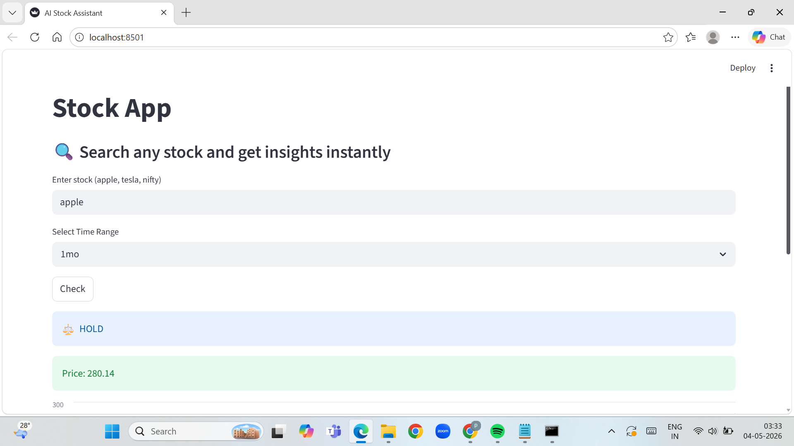

# 📈 AI Stock Assistant

An intelligent stock analysis web application built with **Streamlit** that provides real-time stock insights, price trends, and simple buy/sell recommendations using technical indicators.

---

## 🚀 Overview

AI Stock Assistant allows users to quickly analyze stocks by simply typing their name.
It fetches live market data and visualizes trends to help users understand market direction.

---

## ✨ Key Features

* 🔍 **Stock Search**

  * Supports Apple, Tesla, Nifty, and more

* 💰 **Real-Time Price Display**

  * Shows latest closing price instantly

* 📊 **Interactive Chart**

  * Visualizes stock price movement

* ⏱️ **Time Range Selection**

  * 1 Month, 3 Months, 6 Months, 1 Year

* 📈 **Buy/Sell Suggestion**

  * Based on Moving Average (MA20 & MA50)
  * Simple trend-based logic:

    * MA20 > MA50 → BUY
    * MA20 < MA50 → SELL

---

## 🖥️ Application Preview



---

## 🛠️ Tech Stack

* **Python**
* **Streamlit**
* **yfinance**
* **Pandas**

---

## ⚙️ How It Works

1. User enters stock name
2. App maps it to stock ticker
3. Fetches historical data using yfinance
4. Calculates moving averages (MA20 & MA50)
5. Displays:

   * Current price
   * Trend chart
   * Buy/Sell suggestion

---

## ▶️ Run Locally

```bash
pip install streamlit yfinance pandas
python -m streamlit run advanced_stock_app.py
```

---

## 📌 Example

**Input:** apple
**Output:**

* Current Price
* Chart
* 📈 BUY / 📉 SELL suggestion

---

## ⚠️ Disclaimer

This application provides **basic technical analysis** for educational purposes only.
It should not be used as financial advice.

---

## 🎯 Project Level

Intermediate-level project combining:

* Real-time data handling
* Data visualization
* Basic financial analysis

---

## 📎 Author

Developed as part of an AI/ML project using Python and Streamlit.

